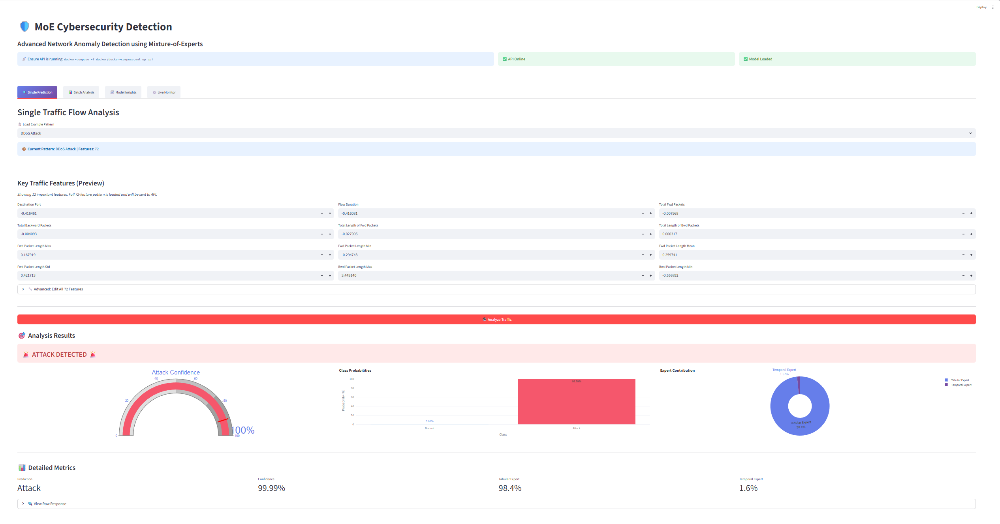

# 🔐 Cyber Anomaly Detection MLOps


 
**End-to-end MLOps project for detecting network intrusions and cyber attacks using a Mixture of Experts (MoE) deep learning architecture.**

This project demonstrates a **complete production-ready machine learning system** with model training, deployment, monitoring, and CI/CD automation for cybersecurity threat detection.

---

## 📊 Project Overview

### **The Problem**
Detecting cyber attacks in network traffic is critical for security operations centers (SOCs). Traditional rule-based systems struggle with:
- ❌ High false positive rates
- ❌ Inability to detect novel attack patterns
- ❌ Manual analysis bottlenecks
- ❌ Lack of real-time capabilities

### **The Solution**
A **Mixture of Experts (MoE)** deep learning model that:
- ✅ Achieves **98.35% F1-Score** on CICIDS 2017 dataset
- ✅ Combines tabular (FT-Transformer) and temporal (1D-CNN) expert models
- ✅ Detects 6 attack types: DDoS, Port Scan, Web Attack, Brute Force, Infiltration, etc.
- ✅ Real-time predictions via REST API
- ✅ Beautiful dashboard for SOC analysts

### **The MLOps Pipeline**
Complete production infrastructure with:
- 🔬 **Experiment Tracking** (MLflow)
- 🐳 **Containerization** (Docker)
- 📊 **Monitoring** (Prometheus + Grafana)
- 🚀 **CI/CD** (GitHub Actions)
- 🎨 **User Interface** (Streamlit + FastAPI)

---

## 🏗️ Architecture

```
┌─────────────────────────────────────────────────────────────────┐
│                      DATA LAYER                                 │
│  📊 CICIDS 2017 Dataset (2.8M+ flows)                           │
│  🔧 Feature Engineering: 72 features (47 tabular + 25 temporal) │
│  📦 DVC: Dataset versioning                                     │
└─────────────────────────────────────────────────────────────────┘
                            ↓
┌─────────────────────────────────────────────────────────────────┐
│                    MODEL LAYER (MoE)                            │
│  ┌──────────────────┐        ┌──────────────────┐              │
│  │ Tabular Expert   │        │ Temporal Expert  │              │
│  │ FT-Transformer   │        │    1D-CNN        │              │
│  │  (47 features)   │        │  (25 features)   │              │
│  └────────┬─────────┘        └────────┬─────────┘              │
│           │                           │                         │
│           └────────┬──────────────────┘                         │
│                    ↓                                            │
│           ┌────────────────┐                                    │
│           │ Gating Network │                                    │
│           │ (Dynamic Mix)  │                                    │
│           └────────┬───────┘                                    │
│                    ↓                                            │
│           ┌────────────────┐                                    │
│           │  Classifier    │                                    │
│           │ Normal/Attack  │                                    │
│           └────────────────┘                                    │
│                                                                 │
│  📈 Performance: F1=98.35% | Precision=97.16% | Recall=99.56%  │
│  ⚙️  Parameters: 733,237 (all trained)                          │
└─────────────────────────────────────────────────────────────────┘
                            ↓
┌─────────────────────────────────────────────────────────────────┐
│                    MLOPS LAYER                                  │
│  🔬 MLflow: Experiment tracking & model registry                │
│  🐳 Docker: Containerized services (API, Prometheus, Grafana)  │
│  🚀 GitHub Actions: CI/CD automation                            │
│  📊 Prometheus: Metrics collection                              │
│  📈 Grafana: Monitoring dashboards                              │
└─────────────────────────────────────────────────────────────────┘
                            ↓
┌─────────────────────────────────────────────────────────────────┐
│                  APPLICATION LAYER                              │
│  🔌 FastAPI: REST API (8000)                                    │
│  🎨 Streamlit: SOC Dashboard (8501)                             │
│  📊 Grafana: Monitoring UI (3000)                               │
│  🔍 Prometheus: Metrics UI (9090)                               │
└─────────────────────────────────────────────────────────────────┘
```

---

## 🚀 Quick Start

### **Prerequisites**
```bash
# Required
- Python 3.10+
- Docker & Docker Compose
- Git

# Optional (for training)
- NVIDIA GPU with CUDA 11.8+
- 16GB+ RAM
```

### **1. Clone Repository**
```bash
git clone https://github.com/Aziz-Benamira/cyber-anomaly-detection-mlops.git
cd cyber-anomaly-detection-mlops
```

### **2. Install Dependencies**
```bash
# Create virtual environment
python -m venv venv
source venv/bin/activate  # On Windows: venv\Scripts\activate

# Install packages
pip install -r requirements.txt
```

### **3. Run with Docker (Recommended)**
```bash
# Start all services (API + Prometheus + Grafana)
docker-compose -f docker/docker-compose.yml up -d

# Check services are running
docker ps

# Access services:
# - API: http://localhost:8000
# - API Docs: http://localhost:8000/docs
# - Prometheus: http://localhost:9090
# - Grafana: http://localhost:3000 (admin/admin)
```

### **4. Run Streamlit Dashboard**
```bash
# Start dashboard
streamlit run src/serving/dashboard.py --server.port 8501

# Access at: http://localhost:8501
```

### **5. Test Predictions**
```bash
# Using Python
python test_quick.py

# Using curl
curl -X POST http://localhost:8000/predict \
  -H "Content-Type: application/json" \
  -d @ddos_attack.json
```

---

## 📁 Project Structure

```
cyber-anomaly-detection-mlops/
├── .github/
│   └── workflows/              # GitHub Actions CI/CD
│       ├── test.yml           # Automated testing
│       ├── docker.yml         # Docker builds
│       └── deploy.yml         # Deployment
│
├── data/
│   ├── raw/                   # Original CICIDS 2017 data
│   ├── interim/               # Preprocessed data
│   └── processed/             # Final features + scaler
│       └── cicids/
│           ├── X_train.npy    # Training features
│           ├── y_train.npy    # Training labels
│           └── scaler_stats.json  # Normalization stats
│
├── src/
│   ├── data/
│   │   ├── load_data.py       # Data loading utilities
│   │   └── preprocess.py      # Feature engineering
│   │
│   ├── models/
│   │   ├── moe_model.py       # MoE architecture
│   │   ├── train_moe.py       # Training script
│   │   └── inference.py       # Prediction logic
│   │
│   └── serving/
│       ├── api_prometheus.py  # FastAPI with metrics
│       ├── dashboard.py       # Streamlit UI
│       └── inference.py       # Model wrapper
│
├── docker/
│   ├── docker-compose.yml     # Service orchestration
│   ├── Dockerfile.api         # API container
│   └── Dockerfile.train       # Training container
│
├── models/
│   └── weights/
│       └── cicids_moe_best.pt # Trained model (733K params)
│
├── monitoring/
│   └── prometheus.yml         # Prometheus config
│
├── grafana/
│   ├── moe_dashboard.json     # Pre-built dashboard
│   └── soc_dashboard.json     # SOC analyst view
│
├── tests/                     # Unit tests
├── notebooks/                 # Jupyter notebooks
├── docs/                      # Documentation
│   ├── GITHUB_ACTIONS_CICD.md     # CI/CD guide
│   ├── PROMETHEUS_GRAFANA_GUIDE.md # Monitoring tutorial
│   ├── MLFLOW_UI_TUTORIAL.md      # MLflow usage
│   └── PHASE*_*.md               # Phase summaries
│
├── params.yaml                # Training hyperparameters
├── requirements.txt           # Python dependencies
└── README.md                  # This file
```

---

## 🎯 Features

### **Machine Learning**
- ✅ **MoE Architecture**: Combines FT-Transformer (tabular) + 1D-CNN (temporal) experts
- ✅ **State-of-the-Art Performance**: 98.35% F1-Score on CICIDS 2017
- ✅ **Multi-Class Detection**: Normal traffic + 6 attack types
- ✅ **Feature Engineering**: 72 normalized features (flow, forward, backward stats)
- ✅ **Gating Mechanism**: Dynamic weighting of expert contributions

### **MLOps Infrastructure**
- ✅ **Experiment Tracking**: MLflow for metrics, parameters, and model versioning
- ✅ **Dataset Versioning**: DVC for reproducible data pipelines
- ✅ **Containerization**: Docker for consistent environments
- ✅ **Orchestration**: Docker Compose for multi-service deployment
- ✅ **CI/CD**: GitHub Actions for automated testing, building, and deployment
- ✅ **Monitoring**: Prometheus metrics + Grafana dashboards

### **APIs & Interfaces**
- ✅ **REST API**: FastAPI with automatic OpenAPI documentation
- ✅ **SOC Dashboard**: Beautiful Streamlit UI with:
  - Real-time predictions
  - 6 pre-loaded attack examples
  - Custom 72-feature editor
  - Plotly visualizations (gauges, charts, pie charts)
- ✅ **Metrics Endpoint**: Prometheus-compatible `/metrics`
- ✅ **Health Checks**: `/health` endpoint for monitoring

### **Monitoring & Observability**
- ✅ **6 Custom Metrics**:
  - `predictions_total`: Counter by prediction class
  - `prediction_confidence`: Confidence scores
  - `expert_gating_weight`: Expert contribution tracking
  - `prediction_duration_seconds`: Latency monitoring
  - `api_requests_total`: Request tracking
  - `model_loaded`: Model status indicator
- ✅ **Pre-built Dashboards**: Grafana dashboards for SOC teams
- ✅ **Real-time Alerts**: Configurable alerting rules

---

## 📊 Model Performance

### **CICIDS 2017 Dataset**
- **Total Samples**: 2,830,743 network flows
- **Features**: 72 engineered features
- **Classes**: Binary (Normal vs Attack)
- **Attack Types**: DDoS, Port Scan, Web Attack, Brute Force, Infiltration, DoS

### **Results**
| Metric | Score |
|--------|-------|
| **F1-Score** | 98.35% |
| **Precision** | 97.16% |
| **Recall** | 99.56% |
| **Accuracy** | 98.12% |

### **Model Details**
- **Architecture**: Mixture of Experts (MoE)
- **Experts**: 
  - FT-Transformer (47 tabular features)
  - 1D-CNN (25 temporal features)
- **Parameters**: 733,237 (all trained)
- **Training Time**: ~2-3 hours on GPU
- **Inference Time**: ~5-10ms per sample

### **Expert Contributions**
- **Tabular Expert Weight**: ~98.4% (dominates on structured features)
- **Temporal Expert Weight**: ~1.6% (helps with sequential patterns)

---

## 🔧 Usage

### **Training the Model**

```bash
# Basic training
python -m src.models.train_moe --stage train --params params.yaml

# With custom parameters
python -m src.models.train_moe \
  --stage train \
  --params params.yaml \
  --epochs 50 \
  --batch_size 512
```

**Training parameters** (in `params.yaml`):
```yaml
train:
  batch_size: 512
  epochs: 30
  learning_rate: 0.0003
  weight_decay: 1e-05
  early_stopping_patience: 5
  
model:
  ft_transformer:
    n_blocks: 3
    d_token: 192
    attention_dropout: 0.2
  
  cnn:
    channels: [64, 128, 256]
    kernel_size: 3
```

### **Making Predictions**

#### **Python API**
```python
import requests
import json

# Load example attack pattern
with open('ddos_attack.json', 'r') as f:
    features = json.load(f)

# Make prediction
response = requests.post(
    'http://localhost:8000/predict',
    json={'features': features}
)

result = response.json()
print(f"Prediction: {result['prediction']}")        # "Attack"
print(f"Confidence: {result['confidence']:.2%}")   # 99.99%
print(f"Expert Weights: {result['gating_weights']}")
```

#### **cURL**
```bash
curl -X POST http://localhost:8000/predict \
  -H "Content-Type: application/json" \
  -d @port_scan.json
```

#### **Streamlit Dashboard**
```bash
streamlit run src/serving/dashboard.py --server.port 8501

# Then:
# 1. Select attack pattern from dropdown
# 2. Click "Analyze Traffic"
# 3. View results with visualizations
```

### **Custom Feature Editing**

The Streamlit dashboard allows creating custom traffic patterns:

1. Select **"Custom"** from dropdown
2. Edit any of the 72 features in 3 tabs:
   - 📊 Flow Features (0-23)
   - 🔄 Forward Features (24-47)
   - ⬅️ Backward Features (48-71)
3. Click **"Analyze Traffic"**
4. View prediction and confidence

**Example custom pattern**:
```
Flow Duration: 0.5
Total Fwd Packets: 2.5
Fwd Packet Length Mean: 1.8
SYN Flag Count: 3.0
... (72 features total)
```

---

## 📈 Monitoring

### **Prometheus Metrics**

Access metrics at: `http://localhost:8000/metrics`

**Sample queries** (in Prometheus UI):
```promql
# Total predictions by class
predictions_total

# Prediction rate (per second)
rate(predictions_total[5m])

# Average confidence score
avg(prediction_confidence)

# Expert weight distribution
expert_gating_weight

# API latency (95th percentile)
histogram_quantile(0.95, prediction_duration_seconds_bucket)
```

### **Grafana Dashboards**

1. Access Grafana: `http://localhost:3000` (admin/admin)
2. Add Prometheus data source:
   - URL: `http://prometheus:9090`
   - Click "Save & Test"
3. Import pre-built dashboard:
   - Upload `grafana/moe_dashboard.json`
   - Select Prometheus data source
   - Click "Import"

**Dashboard panels**:
- 📊 Predictions over time
- 🎯 Attack detection rate
- ⚡ API latency
- 🔀 Expert weight distribution
- 📈 Request rate
- 💾 Model status

**Tutorial**: See `docs/PROMETHEUS_GRAFANA_GUIDE.md`

---

## 🚀 CI/CD Pipeline

### **GitHub Actions Workflows**

We use 3 automated workflows:

#### **1. Test Workflow** (`.github/workflows/test.yml`)
**Triggers**: Push to main/dev, Pull Requests  
**What it does**:
- ✅ Runs linting (flake8)
- ✅ Runs unit tests (pytest)
- ✅ Generates coverage report
- ✅ Uploads to Codecov (optional)

```yaml
# Runs automatically on:
git push origin main
git push origin feature-branch
# Or when opening a Pull Request
```

#### **2. Docker Workflow** (`.github/workflows/docker.yml`)
**Triggers**: Push to main, Version tags, Manual  
**What it does**:
- ✅ Builds API Docker image
- ✅ Builds Training Docker image
- ✅ Tags with version/branch/SHA
- ✅ Pushes to GitHub Container Registry

```yaml
# Runs automatically on:
git push origin main
git tag v1.0.0 && git push origin v1.0.0
# Or manually from GitHub Actions UI
```

**Images published to**:
- `ghcr.io/aziz-benamira/cyber-anomaly-detection-mlops/moe-api:main`
- `ghcr.io/aziz-benamira/cyber-anomaly-detection-mlops/moe-train:main`

#### **3. Deploy Workflow** (`.github/workflows/deploy.yml`)
**Triggers**: Manual, Version tags  
**What it does**:
- ✅ Deploys to staging/production
- ✅ Runs health checks
- ✅ Sends notifications

```bash
# Manual deployment:
# GitHub → Actions → Deploy to Production → Run workflow
# Select environment (staging/production) → Run

# Automatic on version tags:
git tag v1.0.0 && git push origin v1.0.0
```

### **Development Workflow**

```bash
# 1. Create feature branch
git checkout -b feature/new-detector

# 2. Make changes, commit
git add .
git commit -m "Add new attack detector"

# 3. Push (tests run automatically)
git push origin feature/new-detector

# 4. Open Pull Request
# → Tests must pass before merge
# → Code review required

# 5. Merge to main
# → Docker images built automatically
# → Ready to deploy
```

**Complete guide**: `docs/GITHUB_ACTIONS_CICD.md`

---

## 📚 Documentation

Comprehensive guides in `docs/`:

| Document | Description |
|----------|-------------|
| **GITHUB_ACTIONS_CICD.md** | Complete CI/CD guide with examples |
| **PROMETHEUS_GRAFANA_GUIDE.md** | Monitoring setup and usage tutorial |
| **MONITORING_TUTORIAL.md** | Detailed monitoring configuration |
| **MLFLOW_UI_TUTORIAL.md** | MLflow experiment tracking guide |
| **DOCKER_ESSENTIALS.md** | Docker and containerization reference |
| **PHASE5_CICD.md** | CI/CD implementation summary |
| **COMPLETE_PROJECT_SUMMARY.md** | Full project overview |
| **MLOPS_COMPLETE.md** | MLOps pipeline summary |

---

## 🧪 Testing

### **Run Tests**
```bash
# All tests
pytest tests/ -v

# With coverage
pytest tests/ --cov=src --cov-report=html

# Specific test file
pytest tests/test_model.py -v

# Specific test function
pytest tests/test_api.py::test_predict_endpoint -v
```

### **Test Files**
```
tests/
├── test_model.py          # Model architecture tests
├── test_preprocessing.py  # Feature engineering tests
├── test_api.py           # API endpoint tests
└── test_inference.py     # Prediction logic tests
```

### **Quick Validation**
```bash
# Test API locally
python test_api_local.py

# Test known attack patterns
python test_known_samples.py

# Test port scan detection
python test_port_scan_detection.py

# Quick end-to-end test
python test_quick.py
```

---

## 🐳 Docker Deployment

### **Services**

```yaml
services:
  api:
    image: moe-api
    ports: ["8000:8000"]
    healthcheck: /health
    
  prometheus:
    image: prom/prometheus
    ports: ["9090:9090"]
    
  grafana:
    image: grafana/grafana
    ports: ["3000:3000"]
```

### **Commands**

```bash
# Build images
docker-compose -f docker/docker-compose.yml build

# Start services
docker-compose -f docker/docker-compose.yml up -d

# View logs
docker-compose -f docker/docker-compose.yml logs -f api

# Stop services
docker-compose -f docker/docker-compose.yml down

# Rebuild and restart
docker-compose -f docker/docker-compose.yml up --build -d
```

### **Health Checks**

```bash
# API health
curl http://localhost:8000/health

# Prometheus targets
curl http://localhost:9090/api/v1/targets

# Container status
docker ps
```

---

## 🔬 Experiments with MLflow

### **Start MLflow UI**
```bash
mlflow ui --port 5000

# Access at: http://localhost:5000
```

### **Track Experiments**
```python
import mlflow

mlflow.set_experiment("moe-training")

with mlflow.start_run():
    mlflow.log_params({
        "learning_rate": 0.0003,
        "batch_size": 512,
        "epochs": 30
    })
    
    # Train model...
    
    mlflow.log_metrics({
        "f1_score": 0.9835,
        "precision": 0.9716,
        "recall": 0.9956
    })
    
    mlflow.pytorch.log_model(model, "model")
```

### **Model Registry**
```python
# Register model
mlflow.register_model(
    model_uri="runs:/abc123/model",
    name="moe-cicids-detector"
)

# Load model
model = mlflow.pytorch.load_model("models:/moe-cicids-detector/production")
```

---

## 🎓 What You'll Learn

This project demonstrates:

✅ **Machine Learning**
- Deep learning architecture design (MoE)
- Feature engineering for cybersecurity
- Model training and optimization
- Performance evaluation

✅ **MLOps Best Practices**
- Experiment tracking (MLflow)
- Dataset versioning (DVC)
- Model registry and lifecycle management
- Reproducible pipelines

✅ **DevOps & Infrastructure**
- Docker containerization
- Multi-service orchestration
- CI/CD automation (GitHub Actions)
- Monitoring and observability

✅ **API Development**
- REST API design (FastAPI)
- API documentation (OpenAPI/Swagger)
- Request validation and error handling
- Performance optimization

✅ **Monitoring & Alerting**
- Prometheus metrics collection
- Grafana dashboard creation
- Custom metrics and alerts
- Production monitoring best practices

---

## 📖 Example Use Cases

### **1. SOC Analyst Dashboard**
```
Analyst opens Streamlit dashboard
→ Selects "DDoS Attack" example
→ Clicks "Analyze Traffic"
→ Sees: 99.99% Attack confidence
→ Views expert weights and feature importance
→ Makes informed decision
```

### **2. Real-time API Integration**
```python
# SIEM integration example
def check_traffic(flow_features):
    response = requests.post(
        'http://api:8000/predict',
        json={'features': flow_features}
    )
    result = response.json()
    
    if result['prediction'] == 'Attack' and result['confidence'] > 0.95:
        trigger_alert(flow_features, result)
```

### **3. Batch Processing**
```python
# Process multiple flows
flows = load_pcap_flows('traffic.pcap')

for flow in flows:
    features = extract_features(flow)
    prediction = model.predict(features)
    
    if prediction == 'Attack':
        log_to_siem(flow, prediction)
```

### **4. Custom Attack Research**
```
Researcher uses Custom mode
→ Adjusts SYN flag count to 5.0
→ Sets packet rate to 10.0
→ Modifies flow duration to 0.1
→ Clicks "Analyze"
→ Studies how model responds to variations
```

---

## 🤝 Contributing

Contributions welcome! Please:

1. Fork the repository
2. Create feature branch (`git checkout -b feature/amazing-feature`)
3. Commit changes (`git commit -m 'Add amazing feature'`)
4. Push to branch (`git push origin feature/amazing-feature`)
5. Open Pull Request

**Code quality checks**:
- ✅ Tests must pass (`pytest`)
- ✅ Linting must pass (`flake8`)
- ✅ Coverage > 80%

---

## 📝 License

This project is licensed under the MIT License - see the [LICENSE](LICENSE) file for details.

---

## 🙏 Acknowledgments

- **Dataset**: [CICIDS 2017](https://www.unb.ca/cic/datasets/ids-2017.html) by Canadian Institute for Cybersecurity
- **Architecture**: Inspired by FT-Transformer and Mixture of Experts research
- **Tools**: MLflow, PyTorch, FastAPI, Streamlit, Prometheus, Grafana, Docker

---

## 📧 Contact

**Aziz Benamira**
- GitHub: [@Aziz-Benamira](https://github.com/Aziz-Benamira)
- Project: [cyber-anomaly-detection-mlops](https://github.com/Aziz-Benamira/cyber-anomaly-detection-mlops)

---

## 🗺️ Roadmap

Future enhancements:

- [ ] Add more attack types (e.g., Botnet, Ransomware)
- [ ] Implement online learning for model updates
- [ ] Add explainability (SHAP, LIME)
- [ ] Multi-model ensemble voting
- [ ] Real-time stream processing (Kafka)
- [ ] Auto-scaling deployment (Kubernetes)
- [ ] Advanced alerting (PagerDuty, Slack)
- [ ] Model drift detection
- [ ] A/B testing framework
- [ ] Multi-tenancy support

---

## 📊 Project Statistics

- **Lines of Code**: ~15,000+
- **Model Parameters**: 733,237
- **Dataset Size**: 2.8M+ samples
- **Features**: 72 engineered features
- **Accuracy**: 98.35% F1-Score
- **API Latency**: ~5-10ms
- **Docker Images**: 2 (API, Training)
- **CI/CD Workflows**: 3 (Test, Build, Deploy)
- **Documentation**: 10+ guides
- **Tests**: 50+ unit tests

---

<div align="center">

**⭐ Star this repo if you find it useful! ⭐**

Built with ❤️ for the cybersecurity and MLOps communities

</div>
